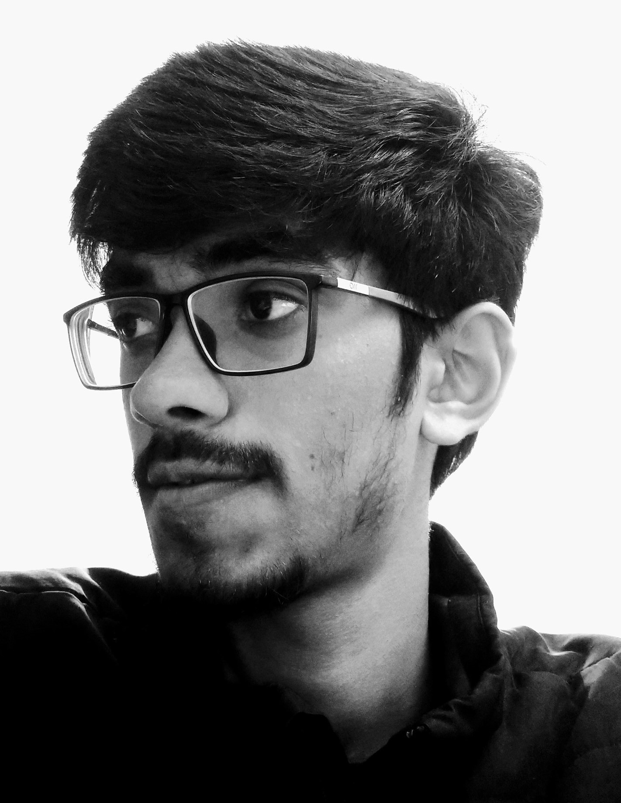

  

Hi, I am Naveen! I am currently a sopohomore at IIT Mandi pursuing a Bachelor of Technology in Computer Science. I am very interested in Web Apps and have a good amount of experience with HTML, CSS, JavaScript, React, etc. I am also quite interested in ML and DL (especially in Computer Vision). I have some experience building cross-platform mobile apps using Flutter.

I like listening to music and singing when I take a break. I love coding & playing the keyboard. I read many novels and my favourite genres are Mystery & Sci-Fi. I also love watching Mystery and Superhero movies (I'm a huge Marvel fan!).

You can reach out to me regarding the blog at [naveensaisreenivas@gmail.com](mailto:naveensaisreenivas@gmail.com)
